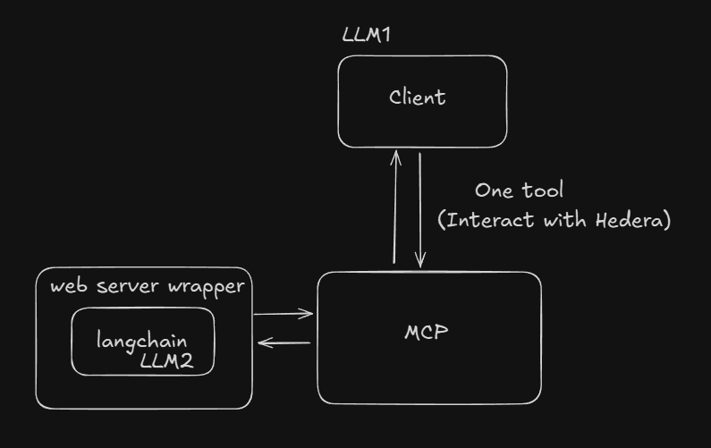

# Hedera MCP Server

This project provides a server that integrates with a Langchain wrapper to interact with the Hedera network. It allows users to perform Hedera operations through natural language commands facilitated by the Langchain setup.

## Prerequisites

Before you begin, ensure you have the following installed:
- Node.js (20 or later recommended)
- pnpm (`npm install -g pnpm`)
- Git

## Quickstart
The whole thing consists of two services that we need to run.

1.  **Clone the repository:**
    ```sh
    git clone https://github.com/mateuszm-arianelabs/hedera-mcp-server.git
    cd hedera-mcp-server
    ```

2.  **Set up environment variables in packages:**
    - You need to copy the .env.example file and create .env from it in two locations:
        - packages/langchain-proxy
        - packages/mcp-server

Edit the `.env` file and fill in the required configuration values (e.g., Hedera keys, network details).
```shell
API_URL=                  # url to langchain proxy endpoint
PORT=                     # port on which MCP server will be started
MCP_AUTH_TOKEN=           # array of accepted tokens separated by comas
LANGCHAIN_PROXY_TOKEN=    # token for accessing the Langchain proxy
```

3.  **Install dependencies:**
    ```sh
    pnpm install
    ```

4.  **Start Lang chain Proxy Service**
    ```
    pnpm run dev:lc
    ```
    (Or `pnpm start` for production mode, if configured).
5.  **Run the mcp server:**
    ```sh
    pnpm run dev:mcp
    ```
    (Or `pnpm start` for production mode, if configured).

## Available Tools

-   **Interact with Hedera:** This core functionality enables the server to make calls to the running Langchain wrapper service. The wrapper then interprets these requests and performs the corresponding actions on the Hedera network (e.g., creating tokens, transferring HBAR, interacting with smart contracts).

## Configuration for Visual Studio Code
To establish a connection with an MCP server, the `X-MCP-AUTH-TOKEN` header is required.

Below is an example .vscode/settings.json configuration for Visual Studio Code:

```
{
    "mcp": {
        "inputs": [],
        "servers": {
            "hedera": {
                "type": "sse",
                "url": "http://localhost:3000/sse",
                "headers": { "X-MCP-AUTH-TOKEN": "your-mcp-auth-token"}
            }
        }
    }
}
```

Note: Currently, passing additional headers (such as `X-MCP-AUTH-TOKEN`) is not supported in Cursor IDE.
Source: [Cursor Forum](https://forum.cursor.com/t/api-key-for-sse-mcp-servers/63300)
However, MCP integration is evolving rapidly, and support for custom headers is expected to be added in future versions of Cursor and other MCP Client Tools.

## Potential Transition to OAuth

As of **March 2025**, the official MCP OAuth specification has been published, but it still has several limitations and implementation challenges. A revision of the approach is likely ([source](https://auth0.com/blog/an-introduction-to-mcp-and-authorization/)).

In preparation for future OAuth integration, here are some example repositories that showcase MCP + OAuth setups:

- [Cloudflare MCP + Auth0](https://github.com/cloudflare/ai/tree/main/demos/remote-mcp-auth0)
- [Cloudflare MCP + GitHub OAuth](https://github.com/cloudflare/ai/tree/main/demos/remote-mcp-github-oauth)
- [Geelen’s MCP Remote Example](https://github.com/geelen/mcp-remote)

These can be used as references when considering OAuth-based authentication for MCP servers in future development phases.


## Simplified Architecture

 

## API Documentation (langchain-proxy)

### GET /sse

Establishes a Server-Sent Events (SSE) connection with the MCP server.

#### Request

```
GET /sse
X-MCP-AUTH-TOKEN: example-token
```

| Header     | Type | Description                                                                                                   |
|------------|------|---------------------------------------------------------------------------------------------------------------|
| X-MCP-AUTH-TOKEN | string | Required authentication token that must match one of the tokens in servers env file (MCP_AUTH_TOKEN variable) |

#### Response

On successful authentication, establishes an SSE connection with content type `text/event-stream`.

**Status Codes**

`200 OK`: Connection established successfully
`401 Unauthorized`: Invalid or missing authentication token

**Error response**
```json
{
      "content": [
        {
          "type": "text",
          "content": "Unauthorized: Invalid or missing X-MCP-AUTH-TOKEN header"
        }
      ]
    }
```

